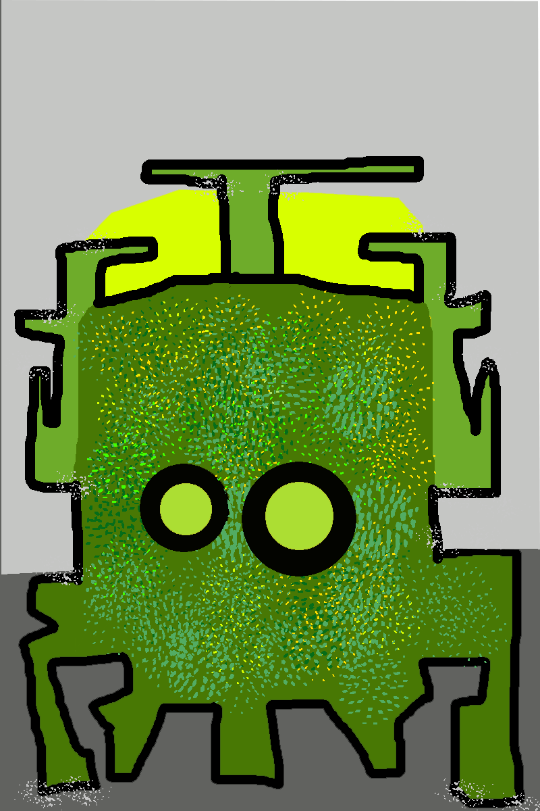

# Hello everyone!. My name is Daniel Prisco and this is my personal website.

 
&nbsp;Here you will find different things related to my experience as a Software Developer.

 
 
 

### Platforms I like to use:

<or>
  <li>
    <a href="https://stackoverflow.com/users/11717481">stackoverflow</a>  

  </li>
  <li> <a href="https://www.codewars.com/users/hexorhex">codewars   </a>
  </li>
</or>
  
 
 

### sections

- [about me](about)
- [contact](contact)
- [blog](blog)
- [projects](projects)

 

---

 This work is licensed under a <a rel="license" href="http://creativecommons.org/licenses/by-sa/4.0/">Creative Commons Attribution-NonCommercial-ShareAlike 4.0 International License</a>.
